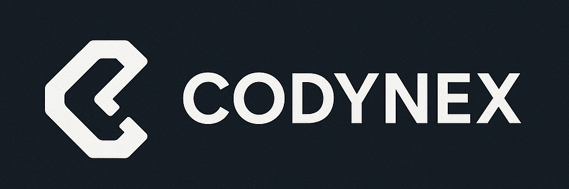

# Codynex Technologies

**Transform Your Business with Digital Excellence**

We create stunning websites, powerful software solutions, and innovative digital experiences that help your business grow and succeed.

## 🚀 About Us

Codynex Technologies is a leading web development and software solutions company specializing in creating modern, high-performance websites and custom software applications. With **10+ completed projects**, **10+ happy clients**, and **3+ years of experience**, we deliver cutting-edge digital solutions tailored to your business needs.

### Our Stats
- ✅ **10+** Projects Completed
- ✅ **10+** Happy Clients  
- ✅ **3+** Years Experience
- ✅ **24/7** Support Available

## 💼 Our Services

### Core IT Services 💡

#### 🌐 Website Design & Development
Professional website development tailored to your business needs
- Static Websites
- Dynamic Websites
- Business / Portfolio Websites
- Corporate Websites
- Single Page Websites
- *Best for small businesses & startups*

#### 🛒 E-Commerce Website Development
Complete online store solutions to grow your business
- Online Store Setup
- Product & Category Management
- Payment Gateway Integration
- Order & Customer Management
- Mobile-friendly E-commerce

#### 💻 Web Application Development
Custom web applications built with modern technologies
- Custom Web Applications
- Admin Dashboards
- CRM / ERP Web Systems
- Booking & Management Systems
- Laravel / PHP Based Applications
- React / Node Based Applications

#### 📱 Mobile App Development
Native Android applications for your business
- Android Applications
- Business Apps
- POS Mobile Apps

### Business Software Solutions 🏢

#### 🧾 POS Billing Software ⭐ (Our Flagship Product)
Complete point of sale solution for your business
- POS for Retail & Shops
- Barcode Scanning & Printing
- Inventory Management
- GST Billing
- Offline & Online Support

#### 🧠 Custom Software Development
Tailored software solutions for your unique requirements
- Business Process Automation
- Custom Tools for Offices
- Reporting & Analytics Systems
- Internal Management Software

### Digital Presence & Growth 📈

#### 🔍 SEO Setup & Website Optimization
Boost your online visibility and reach more customers
- Basic SEO Setup
- Google Search Console
- Google Analytics
- Performance Optimization

#### 📍 Google My Business (GMB) Setup
Get found locally with proper Google Business setup
- Business Profile Creation
- Location & Map Setup
- Local Visibility Support

### Support & Maintenance 🛠️

#### 🔧 Website Maintenance & Support
Keep your website running smoothly and securely
- Content Updates
- Bug Fixes
- Security Updates
- Performance Monitoring
- Annual Maintenance (AMC)

#### ☁️ Domain, Hosting & Email Setup
Complete web infrastructure setup and management
- Domain Registration
- Web Hosting Setup
- Business Email
- SSL & Security Setup

## 💰 Pricing Plans

- **Single Page Website**: ₹3,999 (Renewal: ₹2,000/year)
- **Standard Website**: ₹8,999 (Renewal: ₹3,000/year) ⭐ Most Popular
- **E-Commerce Website**: ₹14,999 (Renewal: ₹6,000/year)
- **Custom Application**: Custom pricing based on requirements

### Additional Services
- **Custom Mobile App Development**: Starting from ₹39,999
- **Logo Creation**: ₹2,500
- **Contact Card Creation**: ₹1,000

## 📞 Contact Us

Get in touch with us for your next project:

- 📧 **Email**: [support@codynextech.com](mailto:support@codynextech.com)
- 📱 **Phone**: [+91 93450 21613](tel:+919345021613)
- 💬 **WhatsApp**: [Chat with us](https://wa.me/9345021613)
- 📷 **Instagram**: [@codynex.tech](https://www.instagram.com/codynex.tech/)
  
---

© 2024 Codynex Technologies. All rights reserved.
