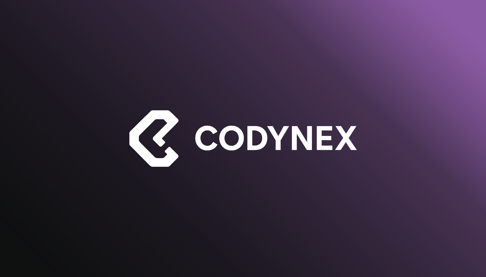

# Codynex Technology

**Premium Web Development · SaaS · Digital Marketing**

*Built for startups and growing businesses. Enterprise quality, startup-friendly pricing.*

---

## 🏢 About Us

**Codynex Technology** is a web development and digital marketing agency based in **Coimbatore, Tamil Nadu, India**. We build modern websites, web applications, SaaS platforms, and run digital marketing campaigns for businesses across India and internationally.

We exist to give startups and growing businesses access to the same quality of technology that enterprise companies take for granted — without the enterprise price tag.

| 📦 Projects Delivered | 😊 Client Satisfaction | ⚡ Avg Lighthouse Score | 🗓️ Years Experience |
|:---:|:---:|:---:|:---:|
| **10+** | **100%** | **98 / 100** | **4+** |

---

## 💼 Services

### 🌐 Web Development
| Service | Starting From |
|---|---|
| Website Development (Landing pages to full corporate sites) | ₹4,000 |
| Web App Development (Dashboards, portals, booking systems) | ₹18,000 |
| Full Stack Development (MERN, PostgreSQL, Docker) | ₹30,000 |
| SaaS Product Development (Auth, billing, multi-tenancy) | ₹45,000 |
| WordPress Websites (Custom themes, WooCommerce) | ₹15,000 |

### 📈 Digital Marketing
| Service | Starting From |
|---|---|
| SEO (Technical + Local + Content) | ₹8,000/mo |
| Google Ads Management | ₹5,000/mo |
| Meta Ads (Facebook + Instagram) | ₹5,000/mo |

### 🛠️ Support & More
- Domain, Hosting & SSL Setup
- Website Maintenance & AMC
- Google My Business Setup
- Logo & Brand Identity — ₹2,500
- Business Email Setup

---

## 🚀 Our Products

### [ReplyWise Pro](https://replywisepro.in) — AI Customer Reply Generator
> Paste any customer message → get 3 polished reply options in under 1 second.

- 8+ Tone modes: Professional, Friendly, Firm, Negotiate & more
- Works in English, Tamil, Hindi, Kannada & Malayalam
- WhatsApp Business, Instagram DMs & support email ready
- Screenshot upload for context-aware replies

### [Codynex POS](https://pos.codynextech.com) — Smart Billing & Business Management
> Complete point-of-sale solution for retail shops and supermarkets.

- GST billing in under 10 seconds · Barcode scanning & printing
- Real-time inventory with stock alerts
- Employee attendance, biometric & payroll automation
- Customer loyalty programs & multi-store management
- **Single store: ₹8,999 lifetime · Multi-store: ₹13,999 lifetime**

---

## 🛠️ Tech Stack

**Frontend**

**Backend**

**Database & Cloud**

---

## 🏆 Featured Projects

| Project | Type | Tech |
|---|---|---|
| [Acropolis Engineering College](https://codynextech.com/portfolio) | Business Website | Next.js, React, SEO |
| [YNot Nutrition](https://codynextech.com/portfolio) | eCommerce | React, Node.js, WooCommerce |
| [Photo X Press](https://codynextech.com/portfolio) | Digital Studio | React, Supabase |
| [Dreamcatcher](https://codynextech.com/portfolio) | Web App / Platform | React, Node.js, MySQL |
| [IRASS](https://codynextech.com/portfolio) | Corporate Website | WordPress, ACF |
| [Syeba Workshop](https://codynextech.com/portfolio) | Service Website | HTML, CSS, JavaScript |
| [ReplyWise Pro](https://replywisepro.in) | SaaS Product | React, Node.js, Stripe |
| [Codynex POS](https://pos.codynextech.com) | Business Software | React, Laravel, MySQL |

---

## 💬 What Our Clients Say

> *"Codynex met every expectation we had. The website is clean, mobile-friendly, and easy to access from any device."*
> — **Syeba Workshop**, Royal Enfield Service Centre

> *"The website development was top-notch — the design is super clean, fully functional, and our customers love it."*
> — **YNot Nutrition**, Fitness & Supplements

> *"They just built what we asked — nothing more, nothing less. The Dreamcatcher platform works flawlessly."*
> — **Dreamcatcher**, Student Program Platform

> *"Codynex transformed our online presence with a stunning eCommerce website that exceeded our expectations."*
> — **KH Pepflora**, Floral Products

---

## 📞 Get In Touch

Ready to build something great?

| Channel | Details |
|---|---|
| 🌐 Website | [codynextech.com](https://codynextech.com) |
| 📧 Email | [support@codynextech.com](mailto:support@codynextech.com) |
| 📱 Phone | [+91 93450 21613](tel:+919345021613) |
| 💬 WhatsApp | [wa.me/919345021613](https://wa.me/919345021613) |
| 📷 Instagram | [@codynex.tech](https://www.instagram.com/codynex.tech/) |
| 📍 Location | Coimbatore, Tamil Nadu, India |

---

**Free 30-minute strategy call · Reply within 2 hours · No hidden costs**

© 2025 Codynex Technology. Built in Coimbatore. Serving the world.

